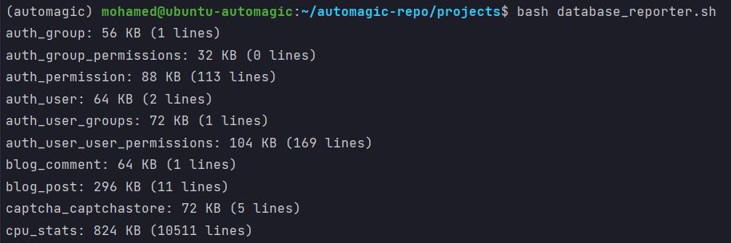
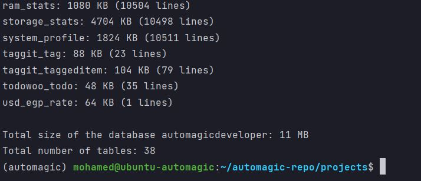
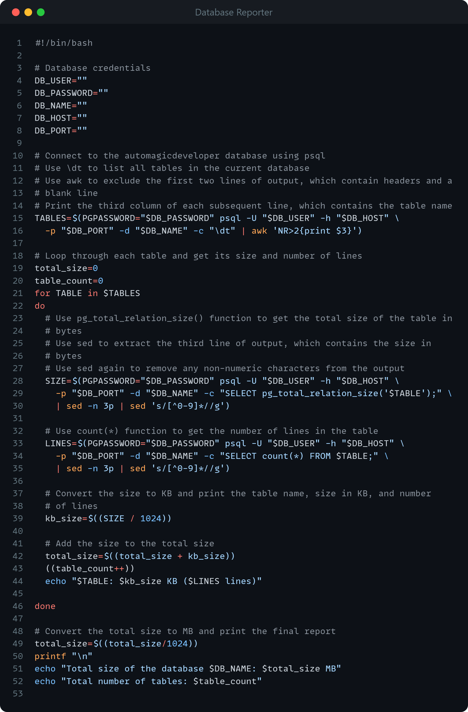

<!-- PROJECT SHIELDS -->
<!--
*** I'm using markdown "reference style" links for readability.
*** Reference links are enclosed in brackets [ ] instead of parentheses ( ).
*** See the bottom of this document for the declaration of the reference variables
*** for contributors-url, forks-url, etc. This is an optional, concise syntax you may use.
*** https://www.markdownguide.org/basic-syntax/#reference-style-links
-->

<a name="readme-top"></a>

[![LinkedIn][linkedin-shield]][linkedin-url]


<!-- PROJECT LOGO -->
<br />
<div align="center">
    

  <h3 align="center">PostgreSQL Database Reporter</h3>

</div>


<!-- TABLE OF CONTENTS -->
<details>
  <summary>Table of Contents</summary>
  <ol>
    <li>
      <a href="#about-the-project">About The Project</a>
      <ul>
        <li><a href="#built-with">Built With</a></li>
      </ul>
    </li>
    <li>
      <a href="#getting-started">Getting Started</a>
      <ul>
        <li><a href="#libraries">Libraries</a></li>
        <li><a href="#packages">Packages</a></li>
        <li><a href="#service-accounts">Service Accounts</a></li>
        <li><a href="#known-exceptions">Known Exceptions</a></li>
      </ul>
    </li>
    <li><a href="#usage">Usage</a></li>
    <li><a href="#roadmap">Roadmap</a></li>
    <li><a href="#license">License</a></li>
    <li><a href="#contact">Contact</a></li>
  </ol>
</details>


<!-- ABOUT THE PROJECT -->
## About The Project



* Project Name: PostgreSQL Database Reporter
* Version: v1.0.0

### Description

This script connects to a PostgreSQL database and retrieves the total 
size of each table in the database in KB. 

It uses the psql command-line utility to execute a SQL query that 
retrieves the size of each table, and then prints the size of each 
table in KB along with the table name. 

It also calculates the total size of all tables and the total number 
of tables in the database and prints the results at the end of the script. 

The script uses variables to store the database credentials and table names, 
making it easy to modify the script to work with different databases or 
tables. 

The script includes comments that explain each step of the process and 
makes it easy to understand and modify. 

The script is useful for database administrators who want to quickly 
retrieve and analyze the size of tables in a PostgreSQL database.

Main features:
* Provides a quick and easy way to retrieve the total size of all tables in 
a PostgreSQL database.
* Displays the size of each table in kilobytes (KB) for easy readability.
* Displays the number of tables included in the final report.
* Uses standard PostgreSQL functions and commands, making it compatible 
with most PostgreSQL databases.
* Can be easily modified to include additional information about each table, 
such as the date the table was last updated.
* Uses shell scripting, which is commonly available on most Unix-like systems 
and requires no additional software installation.

<p align="right">(<a href="#readme-top">back to top</a>)</p>


### Built With

This project was developed using the following tech stacks:

* Bash / Shell Scripting

<p align="right">(<a href="#readme-top">back to top</a>)</p>


<!-- GETTING STARTED -->
## Getting Started

In this section, I will give you instructions on setting up this project locally.
To get a local copy up and running follow these simple steps.

### Libraries

* None

### Packages
* None

### Service Accounts
* None

### Known Exceptions
* None

<p align="right">(<a href="#readme-top">back to top</a>)</p>


<!-- USAGE EXAMPLES -->
## Usage

To Run the script, you need to:
1. Fill the following variables at the top of the script:
   * DB_USER
   * DB_PASSWORD
   * DB_NAME
   * DB_HOST
   * DB_PORT
2. use the below command to execute the script:
```sh
  bash postgresql_database_reporter.sh
  ```

### Screenshots


<br>


<p align="right">(<a href="#readme-top">back to top</a>)</p>


<!-- ROADMAP -->
## Roadmap

- [x] Defined the requirements of the script: what information does it 
need to retrieve and display? What are the inputs and outputs?

- [x] Decided on the scripting language to use. For this particular script, 
Bash is a good choice, since it can interact with PostgreSQL and is 
available on most Unix-like systems.

- [x] Determined the necessary database credentials, such as the username, 
password, host, port, and database name. These should be stored in 
variables in the script for easy modification.

- [x] Used the `psql` command to connect to the database and retrieve a list 
of all tables in the database using the `\dt` command. Used `awk` to extract 
only the table names from the output.

- [x] Looped through each table and used the `pg_total_relation_size() `
function to retrieve the size of the table in bytes. Used `sed` to extract 
the relevant output and remove any non-numeric characters.

- [x] Converted the table size to kilobytes and print the table name and 
size to the console.

- [x] Added up the total size of all tables and print it to the console, 
along with the total number of tables.
- 
- [x] Tested the script thoroughly with various databases and 
table sizes, and refined as necessary.

<p align="right">(<a href="#readme-top">back to top</a>)</p>

<!-- LICENSE -->
## License

Distributed under the MIT License. See `LICENSE.txt` for more information.

<p align="right">(<a href="#readme-top">back to top</a>)</p>


<!-- CONTACT -->
## Contact

Mohamed AbdelGawad Ibrahim - [@m-abdelgawad](https://www.linkedin.com/in/m-abdelgawad/) - <a href="tel:+201069052620">+201069052620</a> - muhammadabdelgawwad@gmail.com

GitHub Profile Link: [https://github.com/m-abdelgawad](https://github.com/m-abdelgawad)

<p align="right">(<a href="#readme-top">back to top</a>)</p>


<!-- MARKDOWN LINKS & IMAGES -->
<!-- https://www.markdownguide.org/basic-syntax/#reference-style-links -->
[linkedin-shield]: https://img.shields.io/badge/-LinkedIn-black.svg?style=for-the-badge&logo=linkedin&colorB=555
[linkedin-url]: https://www.linkedin.com/in/m-abdelgawad/
